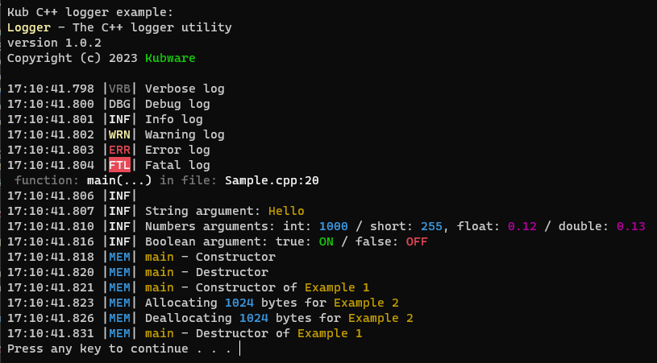

# Kubware C++ Logger

**WARNING - UNDER DEVELOPMENT!!! - do not use until it is stable version**

**Kubware C++ Logger** is simple console or file logger with basic 6 levels of severenity:

 - **VERBOSE** - extra details, memory allocations, etc.
 - **DEBUG** - tracking of function steps.
 - **INFO** - tracking of program flow.
 - **WARNING** - something is not as expected, but program can continue.
 - **ERROR** - something is not working as expected, program execution is not successfull.
 - **FATAL** - there was critical error, program cannot continue.

For logging, there are special **#defines** like **LOG_INFO("Info log");** for each level of severenity.


## Using and installing - manual copy

There are two files containing the logger:

 - **Logger.h**
 - **Logger.cpp**

You can simply include the **Logger.cpp** and **Logger.h** files in your project and build together with your other source code.

## Using and installing - NuGet package

This logger can be included as **NuGet** package in form of static library.
To build NuGet package, install **NuGet.CommandLine** package first.
Than run next command in solution folder using *Package Manager Console*:

```verbatim
.\packNuGet.bat
```

The *packNuGet.bat* batch fille will create **NuGet** package in C:/NuGet folder, that can be referenced by *NuGet Package manager* as local source.

## Versioning

The current logger version is defined in file *logger.h* at

```c++
#define LOGGER_VERSION "1.0.0"
```

and it is shown in logging after start.
The batch script *packNuGet.bat* reads this value and create package with the same version number.

## Example

Link *Logger.h* header file and **kub** namespace. 
Next code shows examples of logger usage:

```c++
#include <iostream>
#include "Logger.h"

using namespace kub;

int main()
{
    std::cout << "Kub C++ logger example:" << endl;

    LOGGER_SETTINGS.level = kub::Logger::Severity::verbose;
    LOGGER_SETTINGS.trueValue = "ON";     // replace "true" to "ON"
    LOGGER_SETTINGS.falseValue = "OFF";
    LOGGER_FILESINK(true,"log.txt");      // turn on filesink

    LOG_VERBOSE("Verbose log");
    LOG_DEBUG("Debug log");
    LOG_INFO("Info log");
    LOG_WARNING("Warning log");
    LOG_ERROR("Error log");
    LOG_FATAL("Fatal log");
    LOG_INFO("");    
    LOG_INFO("String argument: {0}", "Hello");
    LOG_INFO("Numbers arguments: int: {0} / short: {0}, float: {0} / double: {0} ",
        1000, (short)255, 0.12f, 0.13);
    LOG_INFO("Boolean argument: true: {0} / false: {0}",
        true, false);   
}

```



## Licence

**KubLogger** is available under [MIT-licence](./LICENSE.md).

&copy; Kubware 2023


